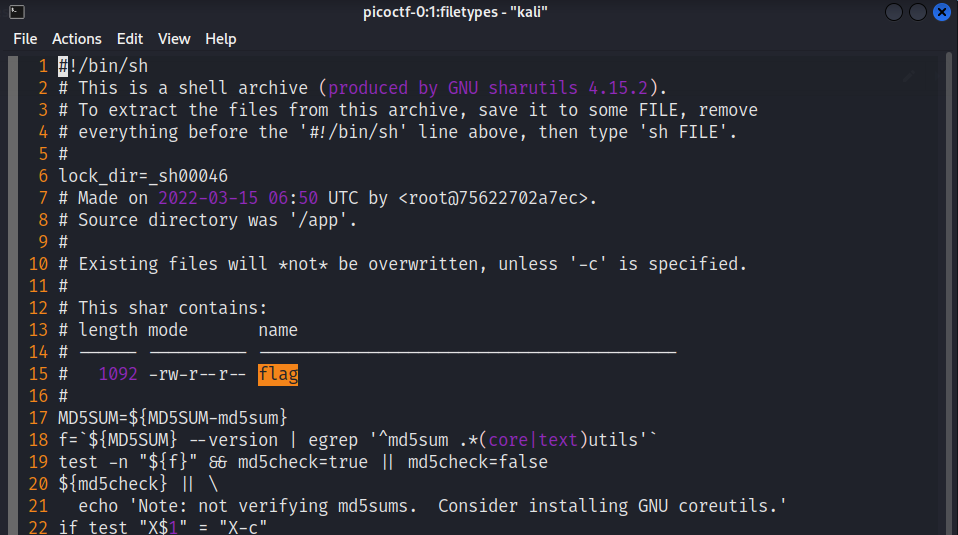
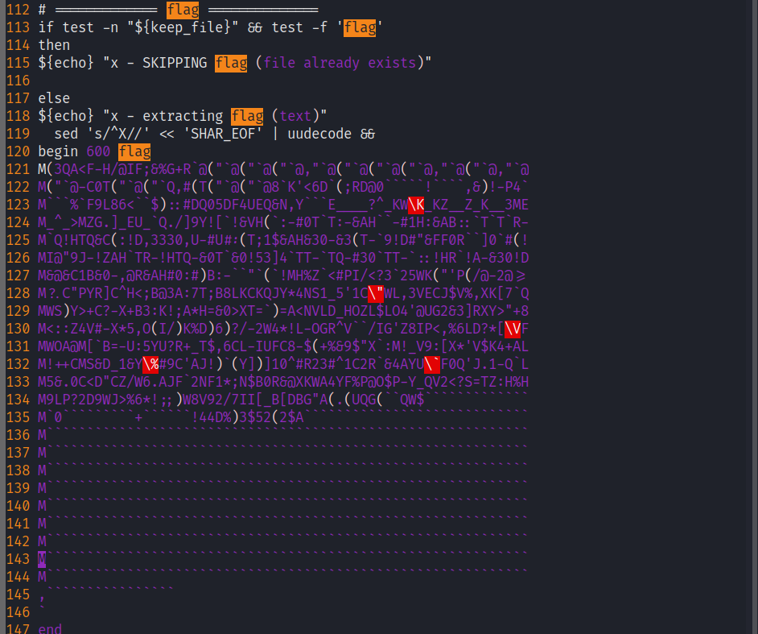
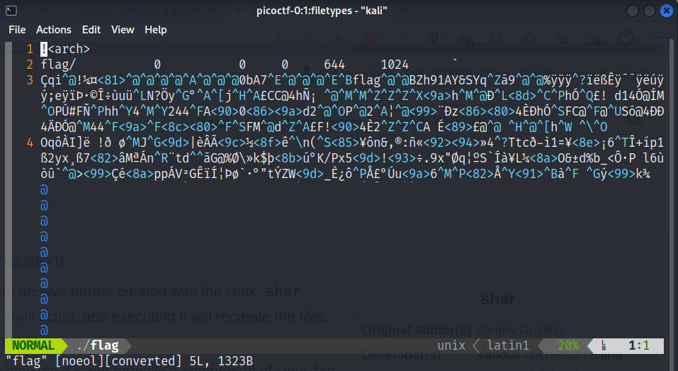
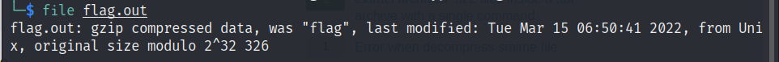
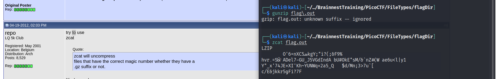
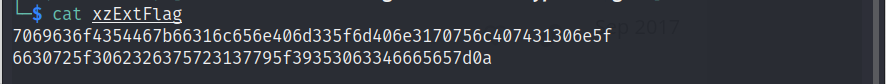
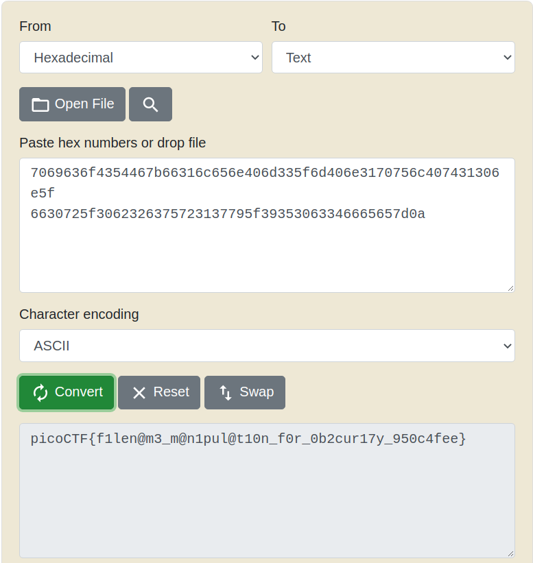

# Intro
`File types` is a challenge on [PicoCTF Website](https://play.picoctf.org/practice/challenge/)in the forensics category.
**Description**: This file was found among some files marked confidential but my pdf reader cannot read it, maybe yours can.

# Flag
`picoCTF{f1len@m3_m@n1pul@t10n_f0r_0b2cur17y_950c4fee}`

# Walkthrough
1. First before opening the file with my PDF reader, I opened it as a text file using *vim* and found that it is a `bash shell` file!    
2. I searched for the flag and found something in the end of the file   
3. Read about what a shell archive is, and found out that it is a self-extracting archive that when executed it will recreate the files.
4. I executed it *(in a virtual machine and after viewing its contect and making sure it does not do something malicious)* and it generated a file called `flag` that has this gibberish content   
5. I didn't figure out its type, so I passed it the `file` utility in linux and it said that it is a `current ar archive`
6. Searched about this archive and found out this type of archives are made with a tool called `ar` that exists in Linux most devices, so I extracted the file using the command `ar x flag`
7. Found another file inside the archive with a type `cpio archive` that, after searching on it, found out that it is another archiving format which can be extracted with a tool called `cpio` on linux 
8. Searched the Internet about `cpio` and wrote the command `cpio -idv < flag` to extract the content of the flag cpio archive
9. Found another flag file that when I ran `file flag` the output was `flag: bzip2 compressed data, block size = 900k`
10. Wrote `bzip2 -d flag` and got a file called `flag.out` that when passed to `file` command I got this    
11. Tried extracting it with `gunzip` but got an error that after seaching on it found that we can use `zcat` instead of `gunzip`    
12. The latest file was `lzip` compressed file so I extracted it with the command `lzip -dk flag -o lzflag.out` and found that the result is a `LZ4 compressed data (v1.4+)`
13. Installed a tool `lz4` and decompressed the file with writing `$ lz4 -dk lzflag.out extlzFlag` and found that the result is `extlzFlag: LZMA compressed data, non-streamed, size 253`
14. Extracted this file with `unlzma` tool by writing `$ unlzma extlzFlag -S "" -c > lzmaExtFlag` and the output file is of type `lzmaExtFlag: lzop compressed data - version 1.040, LZO1X-1, os: Unix`
15. Extracted the file with `lzop` tool by writing `$ lzop -d lzmaExtFlag -o lzopExtFlag` and the output file is of type `lzopExtFlag: lzip compressed data, version: 1`
16. Extracted the file with `lzip` by writing the command `$ lzip -dk lzopExtFlag -o lzipExtFlag` and the output file is of type `lzipExtFlag: XZ compressed data, checksum CRC64`
17. Extracted the file with `xz` by writing the command `$ xz --decompress lzipExtFlag -c > xzExtFlag` and the output was **finally** ASCII text!    
18. It seems that it is *hex* letters so we may convert from *hex* to *text* and see what we get   