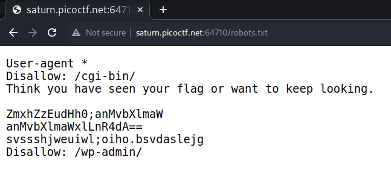
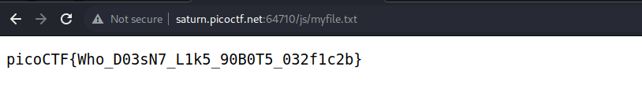

# Intro
This challenge does not say much, it only says that the flag is **somewhere on this web application** not necessarily on this website.

This seems to differentiate between a web application and a website and from searching on the Internet I found that

## Web Application
It is a piece of software that can be accessed by the browser.

## Web Site
Website is a collection of related web pages that contains images, text, audio, video, etc. It can consist of one page, two pages, and n number of pages. 

## Conclusion
Web application is designed for interaction with end users and has much greater files than a website but websites basically contains static content.

# Flag
`picoCTF{Who_D03sN7_L1k5_90B0T5_032f1c2b}`

# Solution
## Quick surfing
First, I started by searching the HTML, CSS and javascript files for any flags by writing `flag` or `picoctf` in the search string but only ordinary results appeared.
Then, I searched in the cookies of the website but found no cookies!
## Scanning
After founding nothing, I thought of content discovery using some fuzzer like `ffuf`, so I wrote the command
```bash
ffuf -w ~/wordlists/content.txt -u http://saturn.picoctf.net:64710/FUZZ -mc all -fc 404
```
Found a `robots.txt` file that showed some encoded string when accessed    
## Analyzing result
This seems to be base64 enconding, so we can try base64-decoding it. Decoded the first 2 and found the second to be `js/file.txt` that when I accessed I found the flag   