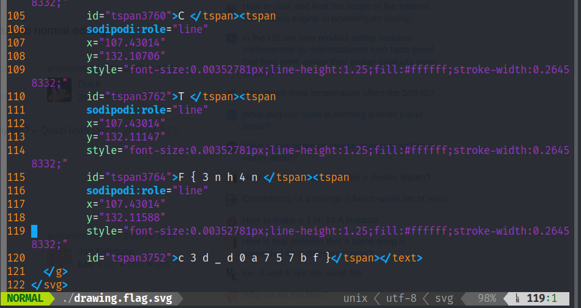

# Intro
`Enhance!` is a challenge on [PicoCTF Website](https://play.picoctf.org/practice/challenge/)that is about forensics.
It is just an `svg` image!

# Flag
`picoCTF{3nh4nc3d_d0a757bf}`

# Walkthrough
1. By definition, an `svg` is an XML file that defines vector-based graphics for the web. So, we can just view the image as a text file using any text editor *(I used vim)*
2. Found the flag distributed among `<tspan></tspan>` tags     