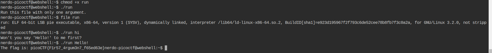

# File-run-1
A very easy challenge that contains a program that you have to download and figure out a way to run it with!

## Flag
`picoCTF{U51N6_Y0Ur_F1r57_F113_47cf2b7b}`

## Solution
Started by seeing the type of the file by writing
```bash
$ file run
```
Then it showed it's an ELF file which is a linux executable.
We should just change the mode of this file to make it executable by running the command
```bash
$ chmod +x run
```

We can now run it by
```bash
$ ./run
```
This will provide us with the flag.

# File-run-2
Same as the previous one, but the executable now needs an argument from the command line!

## Flag
`picoCTF{F1r57_4rgum3n7_f65ed63e}`

## Solution
After making it an executable file, I ran it but it said it needs at least one argument. I wrote `./run hi`, it told me to say 
>Hello!

So I wrote `./run Hello!` so I got the flag   