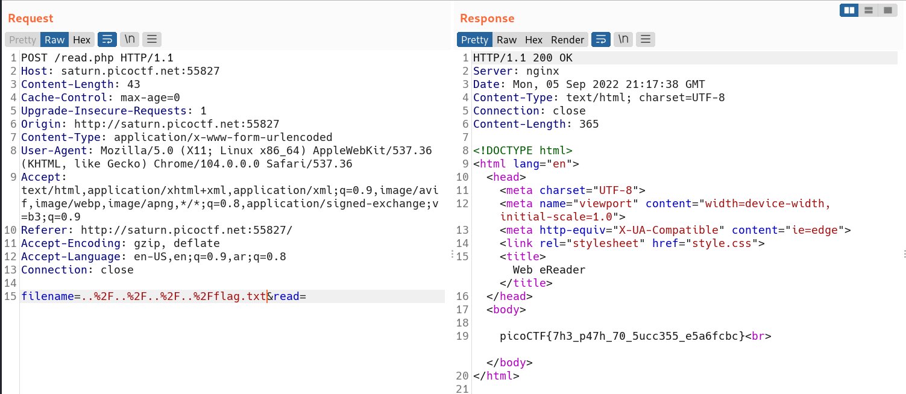

# Intro
This is a challenge on PicoCTF that consists of a website with an input field, and we need to get the flag which lies in `/flag.txt` but we cannot write absolute paths.

# Flag
`picoCTF{7h3_p47h_70_5ucc355_e5a6fcbc}`

# Solution
Since we know that the web application files lie in `/usr/share/nginx/html/` we can try relational paths like `../../../../flag.txt`, and we found it!    