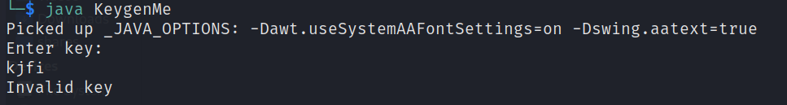
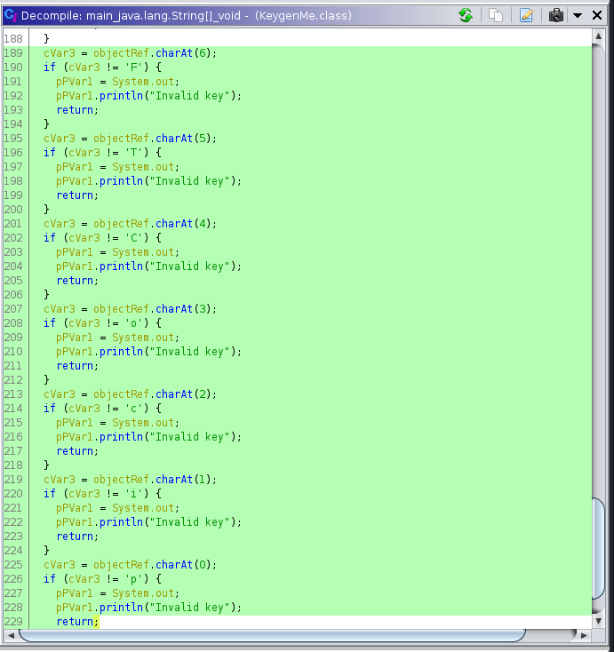

# Intro
A java file that we need to get the flag from.

# Flag
`picoCTF{700l1ng_r3qu1r3d_2bfe1a0d}`

# Solution
First we can start by getting the file type of the downloaded file by running `file KeygenMe.class` and we got
```bash
KeygenMe.class: compiled Java class data, version 55.0 (Java SE 11)
```
## Running the file
Since this a java file, we can just run it by `java KeygenMe` and it prompts a key.    
If the key is invalid it just spits this out and exits.

## Analyzing the binary
After loading, analyzing and decompiling this file into `ghidra`, I found the main function checks on the flag character by character!    
Here, you can see that it checks if the 0th char is a `p` and the 1st char to be `i` and the third to be `c`... etc. This implies that it will be `picoCTF{...}`

## Extracting the key
After concatenating these letters, we will get `picoCTF{700l1ng_r3qu1r3d_2bfe1a0d}` and it is valid!